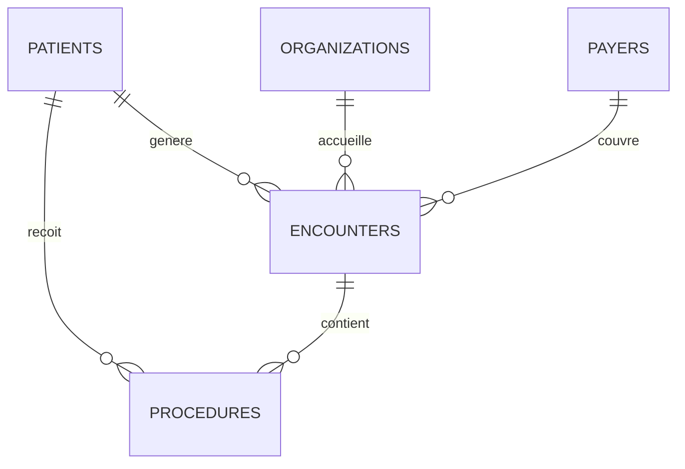

# Architecture et spécifications techniques

Ce document décrit le modèle relationnel, les partis pris de chaque famille de
requêtes et les précautions méthodologiques qui les accompagnent.

---

## 1. Modèle relationnel



| Table | Grain | Volume (jeu synthétique) |
| --- | --- | ---: |
| `patients` | un patient | 400 |
| `encounters` | un passage | 7 160 |
| `procedures` | un acte réalisé pendant un passage | 12 743 |
| `payers` | un organisme payeur | 10 |
| `organizations` | un établissement | 1 |

### Choix de typage

| Colonne | Type | Pourquoi |
| --- | --- | --- |
| `Id` | `CHAR(36)` | UUID de longueur fixe — plus compact et plus rapide qu'un `VARCHAR` |
| `*_COST`, `PAYER_COVERAGE` | `DECIMAL(14,2)` | **jamais `FLOAT` pour de la monnaie** : les erreurs d'arrondi binaires faussent les totaux |
| `START`, `STOP` | `DATETIME` | l'heure compte : les analyses par tranche horaire en dépendent |

Le choix de `DECIMAL` est le plus important. Sur 7 160 passages agrégés, un `FLOAT`
introduit des écarts visibles sur les totaux financiers.

### Index

```sql
CREATE INDEX idx_encounters_patient_start ON encounters (PATIENT, START);
CREATE INDEX idx_encounters_payer         ON encounters (PAYER);
CREATE INDEX idx_encounters_class         ON encounters (ENCOUNTERCLASS);
CREATE INDEX idx_procedures_patient       ON procedures (PATIENT);
CREATE INDEX idx_procedures_encounter     ON procedures (ENCOUNTER);
CREATE INDEX idx_procedures_start         ON procedures (START);
```

`idx_encounters_patient_start` est **composite et ordonné**, ce qui n'est pas un
détail : la requête de retour à 30 jours partitionne par patient et trie par date de
début. L'index sert donc directement la fenêtre `LEAD(...) OVER (PARTITION BY
PATIENT ORDER BY START)`, sans tri intermédiaire.

---

## 2. Organisation des requêtes

Les fichiers sont numérotés dans l'ordre où il faut les exécuter.

| Fichier | Objet |
| --- | --- |
| `01_data_exploration.sql` | volumétrie, plages de valeurs, première prise de contact |
| `02_patient_analytics.sql` | démographie, âges, géographie, recours aux soins |
| `03_encounter_analytics.sql` | activité, durées, retours à 30 jours, couverture payeur |
| `04_procedure_financial_analytics.sql` | actes les plus fréquents et les plus coûteux |
| `05_data_quality_checks.sql` | **à exécuter en premier** — nuls, doublons, dates invalides, intégrité |
| `06_window_functions_cohorts.sql` | classements, cumuls, quartiles, rétention par cohorte |

> Le fichier `05` porte le numéro 5 mais s'exécute **en premier**. Interpréter des
> agrégats sans avoir mesuré la qualité de la source, c'est produire des chiffres
> faux avec assurance.

---

## 3. Techniques SQL employées

### Fonctions fenêtres

| Fonction | Où | Ce qu'elle résout |
| --- | --- | --- |
| `LEAD` | `03` | date du passage suivant, pour mesurer l'intervalle de retour |
| `LAG` | `06` | date du passage précédent, pour la distribution des intervalles |
| `ROW_NUMBER` | `06` | top N strict par classe de passage |
| `DENSE_RANK` | `06` | classement des payeurs, en conservant les ex æquo |
| `NTILE(4)` | `06` | quartiles de dépense patient |
| `SUM() OVER (ORDER BY ...)` | `06` | cumul mensuel des montants |
| `AVG() OVER (ROWS BETWEEN 2 PRECEDING AND CURRENT ROW)` | `06` | moyenne mobile sur 3 mois |
| `SUM(SUM(x)) OVER ()` | `06` | part de chaque ligne dans le total — une agrégation dans une fenêtre |

### Le taux de couverture pondéré

C'est le point où l'on se trompe le plus souvent :

```sql
-- Correct : somme des couvertures / somme des montants
ROUND(SUM(PAYER_COVERAGE) * 100.0 / NULLIF(SUM(TOTAL_CLAIM_COST), 0), 2)

-- Faux : moyenne des ratios
ROUND(AVG(PAYER_COVERAGE / TOTAL_CLAIM_COST) * 100, 2)
```

La moyenne des ratios donne le même poids à un passage de 80 $ et à une
hospitalisation de 40 000 $. Le taux pondéré répond à la vraie question : *quelle
part du montant total est prise en charge ?*

`NULLIF(x, 0)` évite la division par zéro sans masquer le problème : le résultat
devient `NULL`, ce qui se voit, plutôt que d'échouer ou de renvoyer zéro.

### L'âge, mesuré à la bonne date

```sql
TIMESTAMPDIFF(
    YEAR,
    p.BIRTHDATE,
    LEAST(COALESCE(p.DEATHDATE, d.as_of_date), d.as_of_date)
) AS age
```

Appliquer la fin de la fenêtre d'observation à tout le monde attribuerait à un
patient décédé en 2013 l'âge qu'il aurait atteint en 2022. L'âge est donc mesuré à
la date de décès quand elle existe, à la fin de la fenêtre sinon.

---

## 4. Précautions méthodologiques

### Le retour à 30 jours n'est pas un taux de réadmission

La requête mesure l'intervalle entre la fin d'un passage et le **passage suivant
enregistré**. Elle est explicitement décrite comme un **indicateur indirect**.

Un taux de réadmission validé exigerait une définition clinique du séjour index,
des règles d'éligibilité, des exclusions (transferts, sorties programmées,
hospitalisations de jour) et souvent des champs absents du jeu de données.

Nommer cet indicateur « taux de réadmission » serait une erreur d'interprétation,
pas une simplification.

### La rétention par cohorte décrit une activité, pas une fidélité

`06_window_functions_cohorts.sql` regroupe les patients par année de premier
passage et compte ceux qui réapparaissent ensuite. Un patient absent d'une année
peut avoir déménagé, guéri, changé d'établissement ou être décédé.

C'est de la **rétention d'activité enregistrée**, rien de plus.

### Les analyses démographiques ne comparent pas des groupes

Les répartitions par sexe, origine ou ethnicité servent à démontrer le `GROUP BY` et
l'agrégation conditionnelle sur des données synthétiques. Elles ne permettent
d'inférer aucune différence clinique réelle.

### Les identifiants plutôt que les noms

Les requêtes affichent des identifiants patients, jamais des noms. Le jeu est
synthétique, mais la pratique reste la bonne.

---

## 5. Jeu de données synthétique

Le dataset Maven Analytics n'est pas redistribué. `scripts/generate_sample_data.py`
produit un jeu de structure identique, **statistiquement cohérent** :

- répartition des classes de passage calée sur les proportions documentées ;
- nombre de passages par patient suivant une loi log-normale — quelques patients
  concentrent une grande part de l'activité, comme en réalité ;
- coûts dépendant de la classe de passage ;
- couverture dépendant du payeur, `NO_INSURANCE` couvrant zéro ;
- parcours patient chronologiquement cohérent, borné par la date de décès.

Proportions obtenues, comparées au jeu réel :

| Classe | Jeu synthétique | Jeu réel documenté |
| --- | ---: | ---: |
| ambulatory | 44,6 % | 44,9 % |
| outpatient | 23,4 % | 22,6 % |
| urgentcare | 13,0 % | 13,1 % |

### Défauts injectés volontairement

Sans anomalies, `05_data_quality_checks.sql` ne détecterait rien et ne
démontrerait rien :

| Défaut | Occurrences |
| --- | ---: |
| Passages sans date de fin | 59 |
| Date de fin antérieure au début | 2 |
| Passages sans payeur | 35 |

---

## 6. Limites connues

- **Aucun résultat n'est publié dans le dépôt.** Produire un dossier `results/`
  demande un serveur MySQL, dont je ne disposais pas au moment de la rédaction.
  La commande est documentée dans [UTILISATION.md](UTILISATION.md).
- **Le `docker-compose.yml` n'a pas été testé** faute de Docker dans
  l'environnement de développement. Il suit la configuration standard de l'image
  officielle MySQL 8.
- **Pas de vues ni de tables d'agrégat** : chaque requête repart des tables brutes.
  Sur un volume réel, des agrégats matérialisés seraient justifiés.
- **Pas de plan d'exécution commenté.** Deux ou trois `EXPLAIN` annotés
  montreraient l'usage réel des index.
