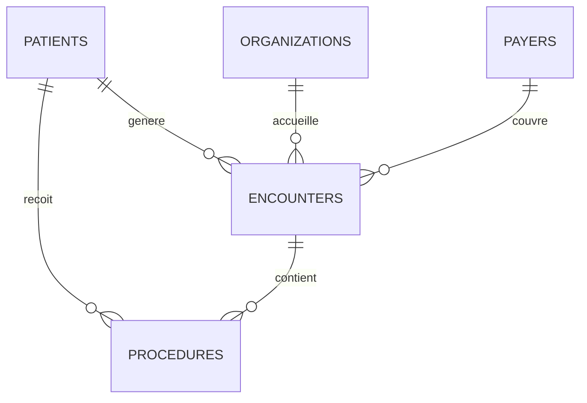

# Hospital SQL Analytics


[](LICENSE)

Étude analytique SQL sur des données hospitalières : contrôles qualité, profil des
patients, activité et durées de passage, retours à 30 jours, coûts des actes et
couverture assureur — avec les fonctions fenêtres, les cohortes et, surtout, les
limites méthodologiques explicitées.

> Projet issu de mon portfolio Data — [juleescourne.github.io/portfolio-data-analyst](https://juleescourne.github.io/portfolio-data-analyst/)

---

## Exécutable en trois minutes

Le dataset Maven Analytics n'est pas redistribuable, ce qui rendait ce dépôt
inexploitable sans compte externe. Il embarque désormais un générateur de données
synthétiques de structure identique.

```bash
docker compose up -d                       # MySQL 8 + schéma appliqué
python scripts/generate_sample_data.py     # 400 patients, 7 160 passages, 12 743 actes
docker compose exec -T mysql mysql --local-infile=1 -uroot -phospital \
  hospital_analytics < db/load_sample_data.sql
```

Sans Docker, trois commandes équivalentes avec un MySQL local :
[INSTALLATION.md](INSTALLATION.md).

Les proportions du jeu synthétique reproduisent celles du jeu réel :

| Classe de passage | Synthétique | Réel documenté |
| --- | ---: | ---: |
| ambulatory | 44,6 % | 44,9 % |
| outpatient | 23,4 % | 22,6 % |
| urgentcare | 13,0 % | 13,1 % |

---

## Ce que le projet démontre

| Domaine | Éléments concrets |
| --- | --- |
| SQL analytique | CTE, `LEAD`, `LAG`, `ROW_NUMBER`, `DENSE_RANK`, `NTILE`, cumuls et moyennes mobiles avec `ROWS BETWEEN` |
| Qualité des données | 18 contrôles : complétude, validité, unicité, intégrité référentielle |
| Modélisation | typage adapté (`DECIMAL` pour la monnaie, jamais `FLOAT`), index composite servant la fonction fenêtre |
| Conception d'indicateurs | taux de couverture **pondéré**, cohortes de rétention, quartiles de dépense |
| Rigueur | chaque indicateur discutable est accompagné de ce qu'il ne mesure pas |

---

## Le modèle



Deux décisions structurent le schéma :

**`DECIMAL(14,2)` pour tous les montants**, jamais `FLOAT`. Sur des milliers de
passages agrégés, les erreurs d'arrondi binaires faussent visiblement les totaux
financiers.

**Un index composite `(PATIENT, START)`** qui sert directement la fenêtre
`LEAD(...) OVER (PARTITION BY PATIENT ORDER BY START)` de la requête de retour à
30 jours — sans tri intermédiaire.

---

## Les requêtes

| Fichier | Objet |
| --- | --- |
| `05_data_quality_checks.sql` | **à lancer en premier** — nuls, doublons, dates invalides, intégrité |
| `01_data_exploration.sql` | volumétrie et plages de valeurs |
| `02_patient_analytics.sql` | démographie, âges, géographie, recours aux soins |
| `03_encounter_analytics.sql` | activité, durées, retours à 30 jours, couverture payeur |
| `04_procedure_financial_analytics.sql` | actes les plus fréquents et les plus coûteux |
| `06_window_functions_cohorts.sql` | classements, cumuls, quartiles, rétention par cohorte |

Le fichier `05` porte le numéro 5 mais s'exécute en premier : interpréter des
agrégats sans avoir mesuré la qualité de la source, c'est produire des chiffres faux
avec assurance.

---

## Deux détails qui font la différence

### Le taux de couverture est pondéré

```sql
-- Correct : part du montant total effectivement prise en charge
SUM(PAYER_COVERAGE) * 100.0 / NULLIF(SUM(TOTAL_CLAIM_COST), 0)

-- Faux : donne le même poids à un passage de 80 $ et à un séjour de 40 000 $
AVG(PAYER_COVERAGE / TOTAL_CLAIM_COST) * 100
```

### Un contrôle qu'aucune clé étrangère ne peut faire

```sql
SELECT COUNT(*) AS procedure_encounter_patient_mismatches
FROM procedures pr
JOIN encounters e ON pr.ENCOUNTER = e.Id
WHERE pr.PATIENT <> e.PATIENT;
```

Un acte dont le patient diffère de celui de son passage. Les deux clés étrangères
sont valides prises séparément : seule une vérification croisée détecte
l'incohérence.

---

## Ce que ces indicateurs ne mesurent pas

C'est le point le plus important du dépôt.

**Le retour à 30 jours n'est pas un taux de réadmission.** La requête mesure
l'intervalle jusqu'au passage suivant enregistré. Un taux validé exigerait une
définition clinique du séjour index, des règles d'éligibilité et des exclusions.

**La rétention par cohorte n'est pas de la fidélité.** Un patient absent d'une année
peut avoir déménagé, guéri, changé d'établissement ou être décédé.

**Les répartitions démographiques ne comparent pas des groupes.** Elles démontrent
le `GROUP BY` sur des données synthétiques et ne permettent aucune inférence
clinique.

---

## Documentation

| Document | Contenu |
| --- | --- |
| [INSTALLATION.md](INSTALLATION.md) | Docker, MySQL local ou jeu réel — et dépannage |
| [UTILISATION.md](UTILISATION.md) | ordre d'exécution, lecture des résultats, production d'un dossier `results/` |
| [ARCHITECTURE.md](ARCHITECTURE.md) | modèle, typage, index, techniques SQL, précautions méthodologiques |
| [docs/data_dictionary.md](docs/data_dictionary.md) | dictionnaire des cinq tables |

---

## Limites assumées

- **Aucun dossier `results/` n'est publié** : le produire demande un serveur MySQL,
  dont je ne disposais pas en rédigeant. La commande est dans
  [UTILISATION.md](UTILISATION.md#produire-un-dossier-de-résultats).
- **Le `docker-compose.yml` n'a pas été testé**, faute de Docker dans
  l'environnement de développement.
- Pas de vues ni d'agrégats matérialisés, pas de plan d'exécution commenté.

---

## Licence

[MIT](LICENSE) — Jules Courné. Le dataset Maven Analytics n'est pas couvert par
cette licence et n'est pas redistribué.
