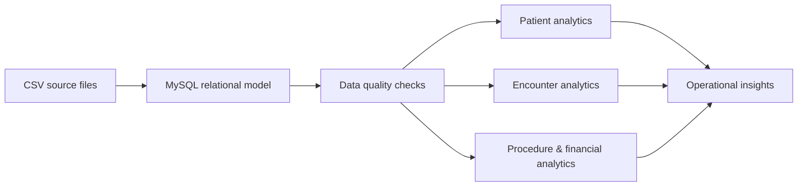
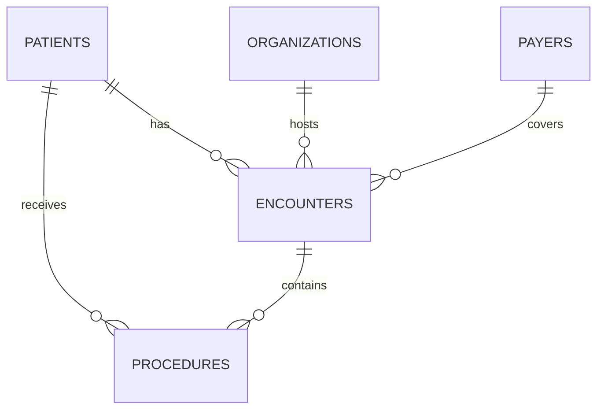

# Hospital Patient SQL Analytics


[](LICENSE)

A portfolio SQL project exploring synthetic hospital patient records with **MySQL**, from data-quality checks and cohort profiling to encounter utilization, return-visit analysis, procedure costs, and payer coverage.

> Part of my Data portfolio: [juleescourne.github.io/portfolio-data-analyst](https://juleescourne.github.io/portfolio-data-analyst/)

The project is designed to demonstrate practical analytics skills with relational healthcare data: **joins, CTEs, window functions, conditional aggregation, date logic, data-quality controls, and business-oriented KPI design**.

> **Data note:** the Maven Analytics Hospital Patient Records dataset is synthetic. This repository is a technical analytics project only; the outputs are descriptive and must not be interpreted as clinical guidance.

## Dataset

Source: **Maven Analytics — Hospital Patient Records**  
Dataset page: `https://mavenanalytics.io/data-playground/hospital-patient-records`

Snapshot used in the original analysis:

| Table | Rows |
|---|---:|
| `patients` | 974 |
| `encounters` | 27,891 |
| `procedures` | 47,701 |
| `payers` | 10 |
| `organizations` | 1 |

The encounter history spans **2011 to early 2022**.

## Questions explored

- What does the patient population look like by age, sex, geography, ethnicity, and race?
- How frequently do patients interact with the hospital?
- Which encounter classes are the most common and the most expensive?
- How long do encounters last, and when does activity peak?
- How many patients return within 30 days of a previous encounter?
- Which procedures are the most frequent and which drive the highest base costs?
- How much of encounter claim cost is covered by payers?
- Are there nulls, invalid dates, duplicates, negative costs, or broken foreign-key relationships?

## Selected findings from the original dataset snapshot

- **Ambulatory encounters** represented about **44.9%** of all encounters.
- **Outpatient encounters** represented about **22.6%**.
- **Urgent-care encounters** represented about **13.1%**.
- Average total encounter claim cost was approximately **$3,639.68**.
- The dataset contained approximately **$101.5M** in total encounter claim amounts.

These values are dataset-specific descriptive results, not hospital performance benchmarks.

## SQL skills demonstrated

- Multi-table `INNER JOIN` and `LEFT JOIN`
- Common Table Expressions (`WITH`)
- Window functions: `ROW_NUMBER`, `DENSE_RANK`, `NTILE`, `LAG`, `LEAD`,
  running totals with `SUM() OVER`, and moving averages with an explicit
  `ROWS BETWEEN` frame
- Cohort retention built from first-encounter year
- Conditional aggregation with `CASE`
- `COUNT(DISTINCT ...)`, `SUM`, `AVG`, `MIN`, `MAX`
- Date/time analysis with `TIMESTAMPDIFF`, `YEAR`, `MONTH`, `QUARTER`, `HOUR`
- Safe ratios with `NULLIF`
- Distribution / bucket analysis
- Referential-integrity and data-quality checks
- Weighted coverage-rate calculations

## Repository structure

```text
hospital-sql-analytics/
├── README.md
├── INSTALLATION.md
├── .gitignore
├── .gitattributes
│
├── db/
│   ├── schema.sql
│   └── load_data.example.sql
│
├── docs/
│   └── data_dictionary.md
│
└── queries/
    ├── 01_data_exploration.sql
    ├── 02_patient_analytics.sql
    ├── 03_encounter_analytics.sql
    ├── 04_procedure_financial_analytics.sql
    ├── 05_data_quality_checks.sql
    └── 06_window_functions_cohorts.sql
```

## Analysis workflow



## Relational model



## Running the project

1. Download the Maven Analytics dataset.
2. Create the MySQL schema with [`db/schema.sql`](db/schema.sql).
3. Import the five CSV files. See [`INSTALLATION.md`](INSTALLATION.md) and [`db/load_data.example.sql`](db/load_data.example.sql).
4. Run [`queries/05_data_quality_checks.sql`](queries/05_data_quality_checks.sql) first.
5. Execute the analysis files in numerical order.

## Important methodology notes

### 30-day return encounters

The query in `03_encounter_analytics.sql` measures the time between a patient's encounter end and their **next recorded encounter**. It is intentionally described as a **30-day return-encounter proxy**, not a clinical readmission rate. A validated readmission metric would require a precise clinical definition, eligibility rules, index-admission logic, exclusions, and potentially additional fields.

### Age at the end of the observation window

Age is computed at the end of the encounter window for living patients and at the recorded
date of death otherwise. Applying the window end to everyone would report a patient who
died in 2013 with the age they would have reached in 2022.

### Cohort retention

The retention query in `06_window_functions_cohorts.sql` groups patients by the year of
their first recorded encounter and measures how many appear again in later years. It
describes *recorded activity only*: a patient missing from a later year may have moved,
recovered, changed provider or died. It is not a measure of care continuity or of
patient loyalty.

### Demographic analyses

Demographic breakdowns are included to demonstrate SQL grouping and conditional aggregation on synthetic data. They should not be used to infer real-world clinical differences between demographic groups.

### Patient identifiers

Portfolio queries use patient IDs rather than displaying patient names. The source dataset is synthetic, but avoiding names keeps the analysis closer to good data-handling practice.

## Why this project matters for my portfolio

This project focuses on the analytical layer of a relational system rather than machine-learning modeling. It demonstrates how I translate raw transactional tables into interpretable metrics, validate data quality, use SQL window functions for temporal behavior, and communicate the limits of operational KPIs.
