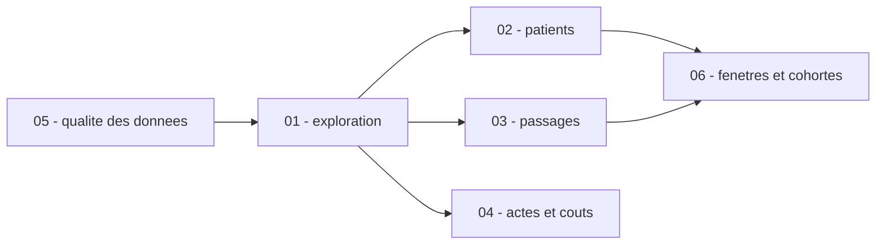

> Parcours vérifié : `bash scripts/run_demo.sh` (Docker) ; exports et interprétations
> dans [results/README.md](results/README.md). Le script recrée uniquement la base
> dédiée `hospital_analytics`. L’index est utilisé, mais le plan montre un tri.

# Guide d'utilisation

Les six fichiers de requêtes se lisent dans un ordre précis. Ce guide explique
lequel, ce que chaque famille répond, et comment interpréter les résultats sans
leur faire dire plus qu'ils ne disent.

---

## Ordre d'exécution



> **Commencez par `05`, malgré son numéro.** Interpréter des agrégats sans avoir
> mesuré les nuls, les doublons et les dates invalides revient à produire des
> chiffres faux avec assurance.

```bash
mysql -u root -p hospital_analytics < queries/05_data_quality_checks.sql
```

---

## 1. Contrôler la qualité — `05`

Dix-huit contrôles répartis en cinq familles :

| Famille | Ce qui est vérifié |
| --- | --- |
| Volumétrie | nombre de lignes par table |
| Complétude | valeurs nulles ou vides sur les colonnes qui comptent |
| Validité | dates de fin antérieures au début, montants négatifs, couverture supérieure au montant |
| Unicité | doublons d'identifiants |
| Intégrité | passages orphelins, actes rattachés à un patient différent de celui du passage |

Le contrôle le plus intéressant est le dernier :

```sql
SELECT COUNT(*) AS procedure_encounter_patient_mismatches
FROM procedures pr
JOIN encounters e ON pr.ENCOUNTER = e.Id
WHERE pr.PATIENT <> e.PATIENT;
```

Il détecte une incohérence qu'aucune clé étrangère ne peut attraper : un acte dont
le patient diffère de celui du passage auquel il est rattaché. Les deux clés
étrangères sont pourtant valides prises séparément.

**Ce qu'il faut faire du résultat.** Sur le jeu synthétique, les anomalies remontées
sont celles injectées volontairement. Sur un jeu réel, notez les volumes concernés
avant d'interpréter la suite : 5 % de passages sans date de fin change la lecture
des durées moyennes.

---

## 2. Prendre la mesure du jeu — `01`

Volumétrie, plages de dates, valeurs distinctes. C'est la prise de contact : combien
de patients, sur quelle période, combien de classes de passage.

---

## 3. Profil des patients — `02`

Répartition par tranche d'âge et sexe, origine, géographie, recours aux soins.

L'âge est mesuré **à la date de décès quand elle existe**, à la fin de la fenêtre
d'observation sinon. Sans cette précaution, un patient décédé en 2013 se verrait
attribuer l'âge qu'il aurait eu en 2022.

> Ces répartitions démontrent le `GROUP BY` et l'agrégation conditionnelle sur des
> données synthétiques. Elles ne permettent d'inférer aucune différence clinique
> réelle entre groupes.

---

## 4. Activité et parcours — `03`

Activité annuelle, durées par classe de passage, distribution des durées, activité
par jour, mois, trimestre et tranche horaire, couverture par payeur.

### Le retour à 30 jours

```sql
WITH ordered_encounters AS (
    SELECT PATIENT, START, STOP,
           LEAD(START) OVER (PARTITION BY PATIENT ORDER BY START, Id) AS next_start
    FROM encounters
    WHERE STOP IS NOT NULL
)
...
WHERE gap_days BETWEEN 0 AND 30;
```

`LEAD` récupère la date du passage suivant du même patient. Le tri porte sur
`(START, Id)` et non sur `START` seul : deux passages à la même seconde donneraient
sinon un ordre non déterministe.

**C'est un indicateur indirect, pas un taux de réadmission.** Un taux validé
exigerait une définition clinique du séjour index, des règles d'éligibilité et des
exclusions. Le présenter autrement serait une erreur d'interprétation.

### Le taux de couverture pondéré

```sql
ROUND(SUM(PAYER_COVERAGE) * 100.0 / NULLIF(SUM(TOTAL_CLAIM_COST), 0), 2)
```

C'est bien une somme de sommes, pas une moyenne de ratios. La moyenne des ratios
donnerait le même poids à un passage de 80 $ et à une hospitalisation de 40 000 $.

---

## 5. Actes et coûts — `04`

Actes les plus fréquents, actes les plus coûteux, coût par classe de passage, reste
à charge.

Fréquence et coût ne se recouvrent pas : un acte courant et peu cher peut peser plus
lourd au total qu'un acte rare et onéreux. Les deux classements sont donc produits
séparément.

---

## 6. Classements, cumuls et cohortes — `06`

| Requête | Technique | Question |
| --- | --- | --- |
| 1 | `ROW_NUMBER` | top 5 des actes les plus coûteux par classe de passage |
| 2 | `DENSE_RANK` + `SUM(SUM()) OVER ()` | classement des payeurs et part du total |
| 3 | `SUM() OVER`, `LAG`, moyenne mobile | activité mensuelle, cumul, variation, tendance |
| 4 | `NTILE(4)` | quartiles de dépense patient — mesure la concentration |
| 5 | cohortes | rétention par année de premier passage |
| 6 | `LAG` | distribution des intervalles entre passages |

### Lire la requête de quartiles

`NTILE(4)` découpe les patients en quatre groupes de taille égale, ordonnés par
dépense totale. La colonne `share_of_total_pct` révèle la concentration : si le
dernier quartile concentre 70 % de la dépense, l'activité repose sur une minorité de
patients — un fait structurant pour un établissement.

### Lire la rétention

Chaque patient appartient à la cohorte de son année de premier passage. On mesure
combien réapparaissent l'année suivante, deux ans après, etc.

> **C'est de la rétention d'activité enregistrée.** Un patient absent d'une année
> peut avoir déménagé, guéri, changé d'établissement ou être décédé. Ce n'est ni de
> la fidélité, ni de la continuité de soins.

---

## Produire un dossier de résultats

Pour figer les sorties et les partager :

```bash
mkdir -p results
for f in queries/*.sql; do
  name=$(basename "$f" .sql)
  mysql -u root -p --table hospital_analytics < "$f" > "results/$name.txt"
done
```

L'option `--table` produit des tableaux ASCII lisibles. Pour du Markdown ou du CSV,
remplacez-la par `--batch` et traitez la sortie.

---

## Adapter les requêtes

| Besoin | Où intervenir |
| --- | --- |
| Changer la fenêtre de retour | `WHERE gap_days BETWEEN 0 AND 30` dans `03` |
| Modifier les tranches d'âge | le `CASE` de la requête 1 de `02` |
| Passer en quintiles | `NTILE(4)` → `NTILE(5)` dans `06` |
| Élargir la moyenne mobile | `ROWS BETWEEN 2 PRECEDING` → `5 PRECEDING` dans `06` |
